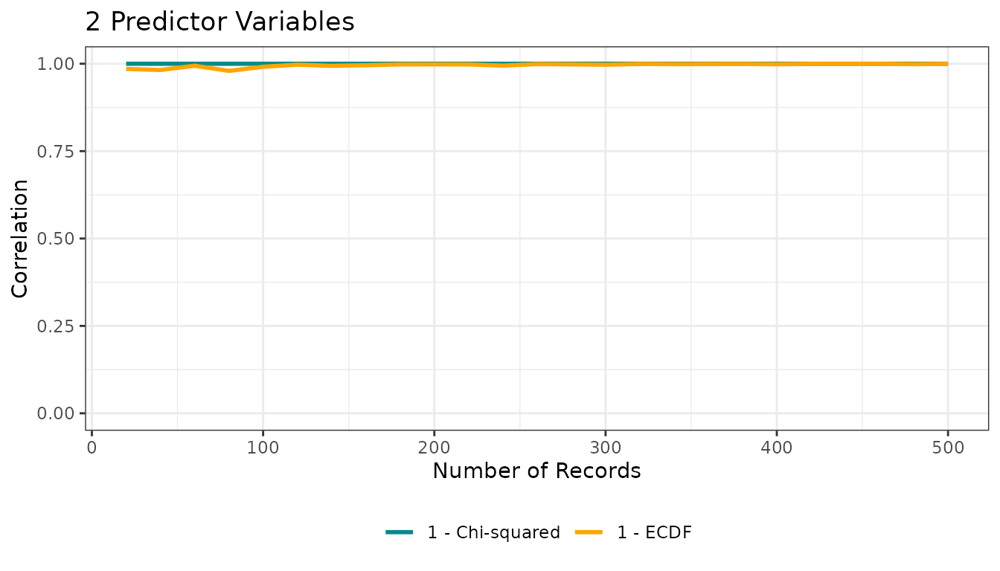
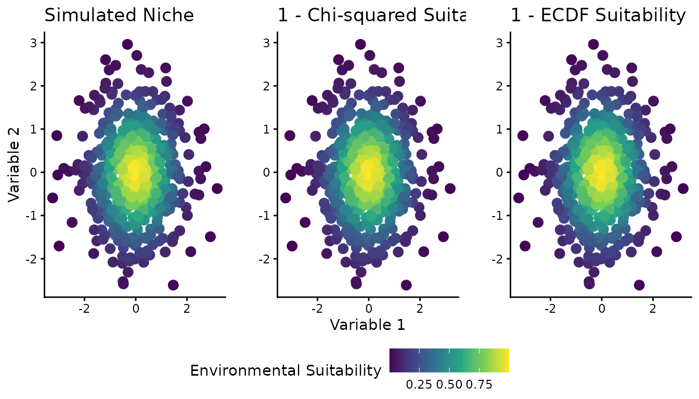
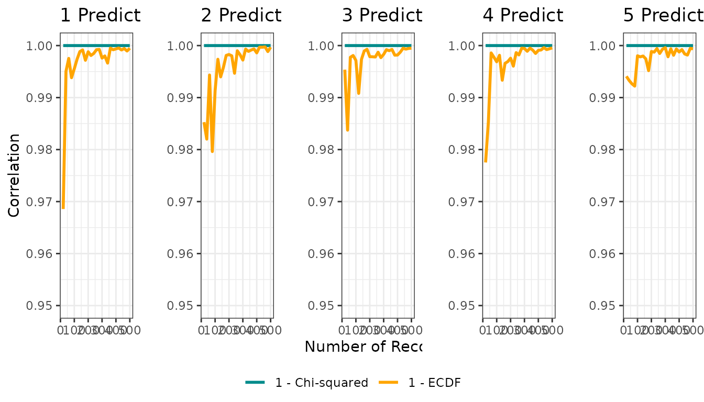
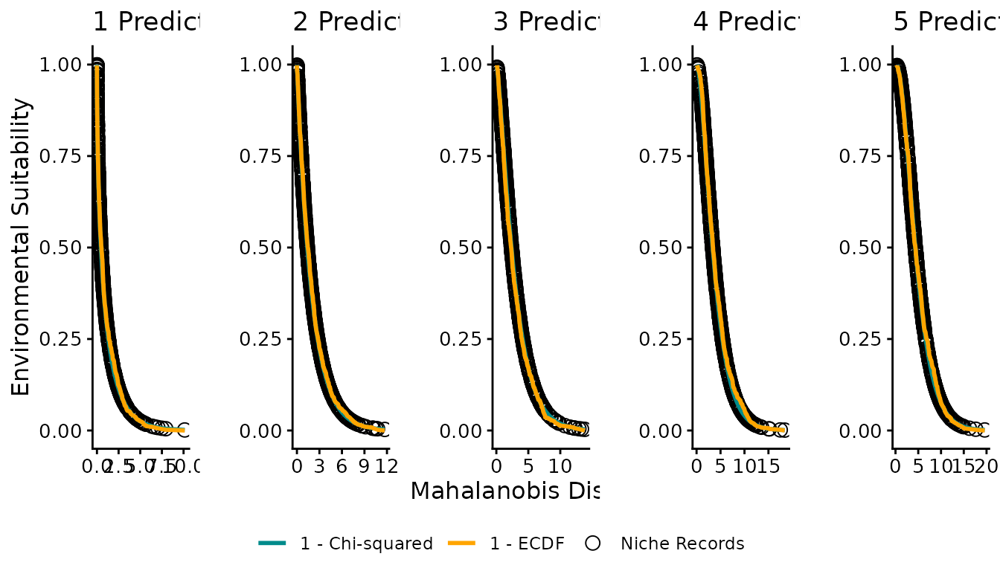
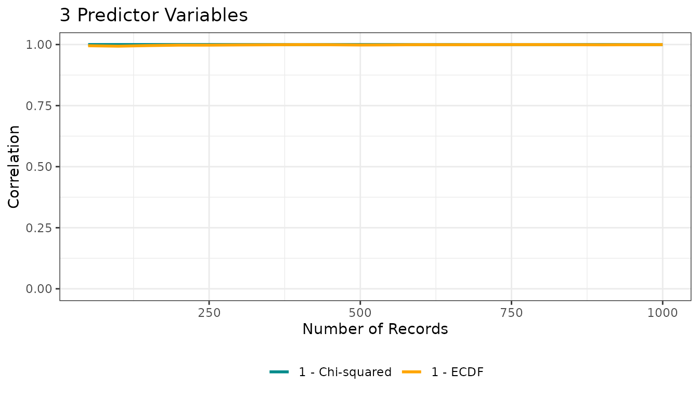

# ECDF and Mahalanobis Distance for Theoretical Niche Modeling

## Introduction

This vignette shows how to use the **ECDFniche** package to reproduce
the simulations from the original `ECDF_MahalDist.R` script, comparing
Mahalanobis distance-based suitability transformations using the
chi-squared distribution and the empirical cumulative distribution
function (ECDF).

``` r

library(ECDFniche)
#> Registered S3 methods overwritten by 'ggpp':
#>   method                  from   
#>   heightDetails.titleGrob ggplot2
#>   widthDetails.titleGrob  ggplot2
```

## Core simulation: `ecdf_theoretical_niche()`

The function
[`ecdf_theoretical_niche()`](https://luizesser.github.io/ECDFniche/reference/ecdf_theoretical_niche.md)
simulates a multivariate normal “environmental space”, computes
Mahalanobis distances for a sample of points, and then maps those
distances to suitability using:

- $`1 - F_{\chi^2}(D^2)`$ (theoretical chi-squared transformation)
- $`1 - \text{ECDF}(D^2)`$ (empirical transformation)

``` r

set.seed(3)
res1 <- ecdf_theoretical_niche(n = 2)
res1$corplot
```



The returned list contains:

- `corplot`: correlation vs sample size between the “true” niche and
  both suitability transformations
- `sample_data`: matrix with the last sample of environmental predictors
- `sample_niche`, `chisq_suits`, `ecdf_suits`: suitability values
- `mahal_dists`: Mahalanobis distances for the last sample

You can directly plot the correlation object:

``` r

res1$corplot
```


## Reproducing the full analysis

The convenience function
[`run_ecdf_mahal_analysis()`](https://luizesser.github.io/ECDFniche/reference/run_ecdf_mahal_analysis.md)
wraps the original workflow: it runs
[`ecdf_theoretical_niche()`](https://luizesser.github.io/ECDFniche/reference/ecdf_theoretical_niche.md)
for several dimensions (by default 1 to 5) and produces three figures
analogous to those in the script.

``` r

set.seed(3)
full_res <- run_ecdf_mahal_analysis(dims = 1:5)
```



### Figure 1: Spatial visualization (2D)

Figure 1 shows the 2D environmental space (two predictor variables) with
color representing different suitability definitions: the simulated
“true” niche, the chi-squared-based suitability, and the ECDF-based
suitability.

``` r

full_res$figure1 |> plot()
```


### Figure 2: Correlation vs sample size

Figure 2 presents, for each dimensionality, how the correlation between
the true niche and each distance-to-suitability transformation changes
with sample size.

``` r

full_res$figure2 |> plot()
```


### Figure 3: Distance–suitability relationships

Figure 3 plots Mahalanobis distance on the x-axis and suitability on the
y-axis, showing how niche records, chi-squared suitability, and ECDF
suitability relate across different numbers of predictor variables.

``` r

full_res$figure3 |> plot()
```


## Customizing simulations

You can customize key aspects of the simulation by passing arguments to
[`ecdf_theoretical_niche()`](https://luizesser.github.io/ECDFniche/reference/ecdf_theoretical_niche.md):

``` r

res_custom <- ecdf_theoretical_niche(
n = 3,
n_population = 20000,
sample_sizes = seq(50, 1000, 50),
seed = 123
)

res_custom$corplot
```



These arguments control the dimensionality, the size of the
environmental “background”, and the grid of sample sizes used to compute
correlations.
