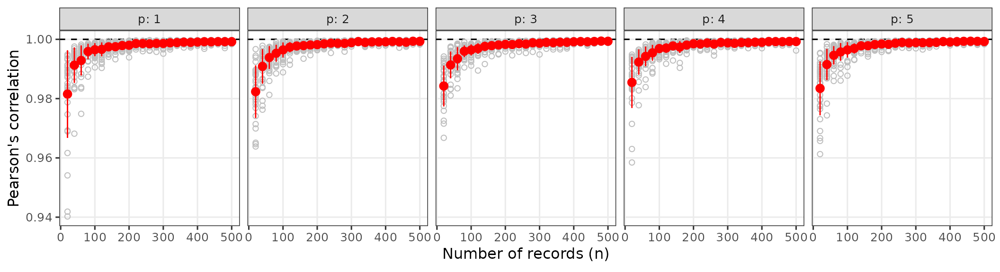
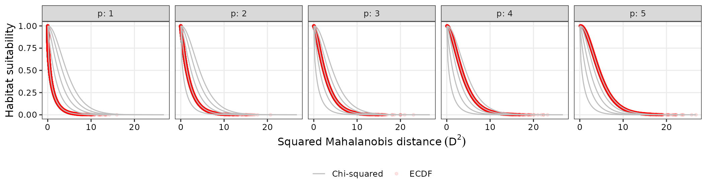
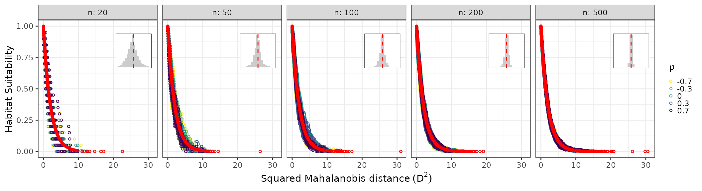
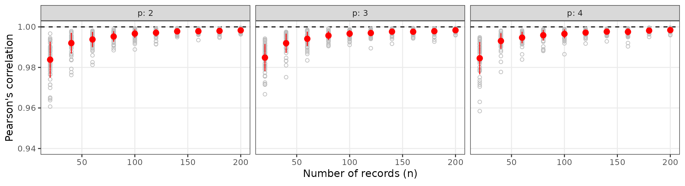
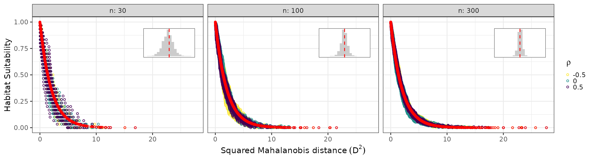

# ECDF and Mahalanobis Distance for Empirical Niche Modeling

## Introduction

This vignette shows how to use the **ECDFniche** package to reproduce
the simulations from the original manuscript, comparing Mahalanobis
distance–based suitability transformations using the chi-squared
distribution and the empirical cumulative distribution function (ECDF).

We follow a *virtual ecologist* approach (Zurell et al. 2010) to
evaluate how different transformations of the Mahalanobis distance
recover a simulated niche across varying dimensionalities (number of
predictor variables) and sample sizes (number of records), and then
extend the analysis to a bivariate non-normal environmental space.

``` r
library(ECDFniche)
#> Registered S3 methods overwritten by 'ggpp':
#>   method                  from   
#>   heightDetails.titleGrob ggplot2
#>   widthDetails.titleGrob  ggplot2
```

## Multivariate normal niche: `ecdf_compare_niche()`

In the first set of simulations, we assume that the environmental
predictors describing a species’ niche follow a multivariate normal
distribution.

Dimensions $p$ range from 1 to 5, and sample sizes $n$ range from 20 to
500 in steps of 20, mimicking increasing numbers of occurrence records.

For each combination of $p$ and $n$,
[`ecdf_compare_niche()`](https://luizesser.github.io/ECDFniche/reference/ecdf_compare_niche.md):

1.  Draws a fixed covariance matrix $\Sigma$ by sampling from a Wishart
    distribution with $p + 2$ degrees of freedom and scale matrix set to
    zero with a diagonal of 1, ensuring a positive-definite covariance
    for that $(p,n)$ combination.
2.  Generates 30 independent replicates of $n$ records from a
    $p$-variate normal distribution with mean vector
    $\mu_{p} = \mathbf{0}$ (interpreted as the environmental optimum)
    and covariance matrix $\Sigma$.
3.  For each replicate, estimates the sample mean $\mu_{r}$ and sample
    covariance $\Sigma_{r}$ and computes the squared Mahalanobis
    distance
    $$D^{2} = \left( x - \mu_{r} \right)^{\top}\Sigma_{r}^{- 1}\left( x - \mu_{r} \right).$$
4.  Computes two suitability metrics for every record:
    - Theoretical chi-squared suitability:
      $$S_{\chi^{2}} = 1 - F_{\chi_{p}^{2}}\left( D^{2} \right),$$ where
      $F_{\chi_{p}^{2}}$ is the cumulative distribution function of the
      chi-squared distribution with $p$ degrees of freedom.

    - Empirical ECDF-based suitability:
      $$S_{\text{ECDF}} = 1 - F_{\text{ECDF}}\left( D^{2} \right),$$
      where $F_{\text{ECDF}}$ is the empirical cumulative distribution
      function of the distances.
5.  Calculates Pearson’s correlation coefficient between $S_{\chi^{2}}$
    and $S_{\text{ECDF}}$ for each replicate.

This setup mimics a realistic ENM scenario where multivariate means and
true covariances are unknown and must be estimated from occurrence
records drawn from a correlated environmental space representing the
species’ theoretical niche (sensu Hutchinson 1978).

``` r
set.seed(1991)
normal_res <- ecdf_compare_niche(
  p_vals = 1:5,
  n_vals = seq(20L, 500L, 20L),
  n_reps = 30L
)
```

### Figure 1: Correlation vs sample size

`cor_plot` summarizes, for each $p$ and $n$, the mean and standard
deviation of the correlation between chi-squared and ECDF suitabilities
across the 30 replicates, with individual replicate values shown as grey
points. The plot shows the correlation between suitability metrics
estimated using the chi-squared and the Empirical Cumulative
Distribution Function (ECDF) across sample sizes and numbers of
environmental predictors. Each panel shows Pearson correlation
coefficients as a function of the number of occurrence records for a
given dimensionality p (1 to 5 variables). Correlations are generally
very high (rarely \< 0.95), increasing with sample size and slightly
increasing with dimensionality.

``` r
normal_res$cor_plot
```



### Figure 2: Suitability vs Mahalanobis distance

`suit_plot` pools observations across sample sizes for each $p$,
recomputes an ECDF-based suitability on the combined distances, and
compares these to chi-squared curves. The plot shows the relationship
between squared Mahalanobis distance (x-axis) and environmental
suitability metrics (y-axis) estimated using the chi-squared and the
Empirical Cumulative Distribution Function (ECDF) across different
numbers of environmental predictors. Grey curves represent the habitat
suitability based on the chi-squared distribution while red circles
represent habitat suitability via ECDF, highlighting that ECDF closely
tracks the theoretical chi‑squared mapping over the distance range.

``` r
normal_res$suit_plot
```



## Non-normal bivariate niche: `ecdf_nonnormal_niche()`

In many real ENM applications, environmental covariates are not jointly
normal and species can show complex responses to environmental gradients
(Anderson et al. 2022).

To explore this,
[`ecdf_nonnormal_niche()`](https://luizesser.github.io/ECDFniche/reference/ecdf_nonnormal_niche.md)
simulates a bivariate environmental space for temperature and
precipitation using a Gaussian copula:

- Temperature follows a normal distribution with mean 20 °C and standard
  deviation 5 °C.
- Precipitation follows a Weibull distribution with shape 2 and scale 10
  mm, representing skewed rainfall data.
- The dependence between the two variables is controlled by a
  correlation parameter $\rho \in \{ - 0.7, - 0.3,0,0.3,0.7\}$,
  reflecting negative to positive associations observed in
  climatological studies (e.g. Anderson et al. 2019).

For each $\rho$, the function:

1.  Uses a Gaussian copula with correlation $\rho$ to generate a large
    reference sample of size $N_{\text{ref}}$ (default $10^{5}$) and
    derive “true” population mean vector and covariance matrix for the
    bivariate distribution.
2.  For each combination of $\rho$ and sample size
    $n \in \{ 20,50,100,200,500\}$, draws $n_{\text{reps}}$ replicate
    samples directly from the copula-based bivariate non-normal
    distribution.
3.  Computes squared Mahalanobis distances $D^{2}$ using the *true* mean
    and covariance from the reference sample, isolating the effect of
    non-normality from parameter estimation error.
4.  Calculates:
    - Chi-squared suitability
      $S_{\chi^{2}} = 1 - F_{\chi_{2}^{2}}\left( D^{2} \right)$, which
      is theoretically “wrong” under non-normality but serves as the
      standard parametric benchmark.
    - ECDF-based suitability
      $S_{\text{ECDF}} = 1 - F_{\text{ECDF}}\left( D^{2} \right)$.
5.  Returns per-replicate correlations and observation-level data, plus
    a summary plot comparing the two suitabilities.

``` r
set.seed(1991)
nonnormal_res <- ecdf_nonnormal_niche(
  rho_vals = c(-0.7, -0.3, 0, 0.3, 0.7),
  n_vals   = c(20L, 50L, 100L, 200L, 500L),
  n_reps   = 10L,
  N_ref    = 1e5
)
```

### Figure 3: Suitability vs distance under non-normality

`suit_plot` shows ECDF-based suitability (colored by $\rho$) and
chi-squared suitability (red points) as functions of $D^{2}$, faceted by
sample size. Plots highlight the sensitivity of chi-squared and ECDF
suitability metrics to sample size and variable correlation in
non-normal bivariate data. Internal histograms represent the
distribution of ECDF-based values around the chi-squared-based
suitability. The ECDF estimator shows higher stochasticity in small
samples but converges to the chi-squared expectation in larger samples.

``` r
nonnormal_res$suit_plot
#> Warning: Removed 2 rows containing missing values or values outside the scale range
#> (`geom_bar()`).
#> Removed 2 rows containing missing values or values outside the scale range
#> (`geom_bar()`).
#> Removed 2 rows containing missing values or values outside the scale range
#> (`geom_bar()`).
#> Removed 2 rows containing missing values or values outside the scale range
#> (`geom_bar()`).
#> Removed 2 rows containing missing values or values outside the scale range
#> (`geom_bar()`).
```



## Customizing simulations

You can customize key aspects of both simulations to reproduce or extend
the analyses:

- **Multivariate normal niche**
  ([`ecdf_compare_niche()`](https://luizesser.github.io/ECDFniche/reference/ecdf_compare_niche.md)):
  - `p_vals`: set of dimensions (e.g. `1:10`) to evaluate
    high-dimensional behavior.
  - `n_vals`: sample size grid, e.g. smaller `n` to explore the effect
    of limited records.
  - `n_reps`: number of replicates per combination for more stable
    summaries.

``` r
res_custom_normal <- ecdf_compare_niche(
  p_vals = 2:4,
  n_vals = seq(20L, 200L, 20L),
  n_reps = 50L,
  seed   = 42
)
res_custom_normal$cor_plot
```



- **Non-normal bivariate niche**
  ([`ecdf_nonnormal_niche()`](https://luizesser.github.io/ECDFniche/reference/ecdf_nonnormal_niche.md)):
  - `rho_vals`: alternative dependence structures.
  - `n_vals`, `n_reps`: sample size and replication design.
  - `N_ref`: reference population size; larger values approximate the
    true parameters more closely.

``` r
res_custom_nonnorm <- ecdf_nonnormal_niche(
  rho_vals = c(-0.5, 0, 0.5),
  n_vals   = c(30L, 100L, 300L),
  n_reps   = 20L,
  N_ref    = 5e4,
  seed     = 123
)
res_custom_nonnorm$suit_plot
#> Warning: Removed 7 rows containing non-finite outside the scale range
#> (`stat_bin()`).
#> Warning: Removed 2 rows containing missing values or values outside the scale range
#> (`geom_bar()`).
#> Removed 2 rows containing missing values or values outside the scale range
#> (`geom_bar()`).
#> Removed 2 rows containing missing values or values outside the scale range
#> (`geom_bar()`).
```



Together, these simulations illustrate when the traditional chi-squared
transformation is reliable and when the ECDF-based approach provides a
more robust mapping from niche-based distances to habitat suitability,
particularly when environmental covariates deviate from multivariate
normality.
